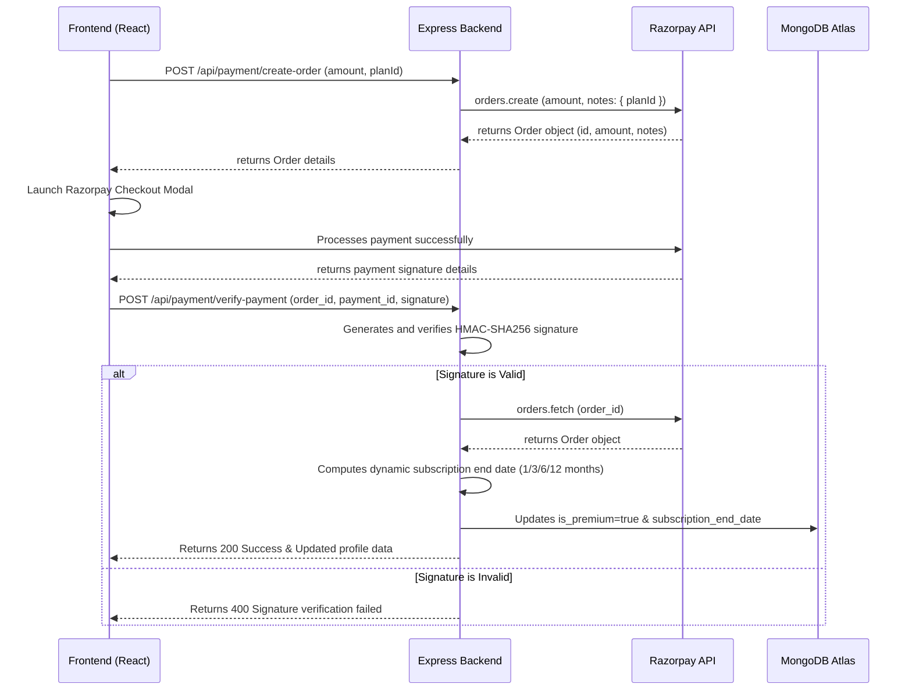

# 🏆 UPTET/CTET Prep App

A state-of-the-art, mobile-first full-stack application designed to empower candidates preparing for **UPTET** and **CTET** exams. Built with a premium glassmorphic UI, robust MERN stack architecture, real-time live contests, smart score prediction analytics, and integrated Razorpay subscription systems.

---

### 📂 Module-Specific Documentation
- 📱 **Frontend React App**: [client/README.md](./client/README.md)
- ⚙️ **Backend Express Server**: [server/README.md](./server/README.md)

---

## 📖 Table of Contents
1. [✨ Key Features & Functionalities](#-key-features--functionalities)
2. [📁 Project Architecture & File Structure](#-project-architecture--file-structure)
3. [⚙️ System Workflows & Payment Security](#-system-workflows--payment-security)
4. [🛢️ Database Schema & Models](#-database-schema--models)
5. [🛠️ Installation & Setup](#-installation--setup)
6. [📡 Deployment](#-deployment)
7. [🛡️ Security & Performance](#-security--performance)
8. [📋 Recent Changes & Fixes](#-recent-changes--fixes)

---

## ✨ Key Features & Functionalities

### 🎓 Student Prep Portal
- **Dynamic Dashboard (Practice / Analytics tabs)**:
  - **Daily Study Goal**: Progress bar tracking daily questions target.
  - **Daily Challenge**: Personalised exam containing up to **50 questions** matching the student's exam level and language options.
  - **Live Contest Room**: Automatic registration flow for daily competitive mock exams at 8:30 PM with waiting rooms, real-time submission limits, and global leaderboards.
  - **Practice Modes**:
    - **Full Mock Exams**: Simulated 150-question, 150-minute exam matching real-world conditions.
    - **Most Repeated Questions**: High-yield PYQs.
    - **Interactive Flashcards**: Front-and-back flip cards for active recall.
  - **Subject-Wise MCQs**: Specialised practice tests for Child Development & Pedagogy, Hindi, English, Sanskrit, Urdu, Math, EVS, Science, and Social Science.
- **Super Tricks Hub**: 
  - Access **100 high-yield tricks, shortcuts, and mnemonics** tailored specifically for UPTET and CTET exams.
  - Choose topics by subject (Child Development & Pedagogy, Hindi, English, Sanskrit, Urdu, Math, EVS, Science, Social Science).
  - Expandable, glassmorphic accordion-style interface for clean topic-wise learning.
  - **Bilingual Text-to-Speech (TTS)**: Built-in speaker buttons to listen to tricks and explanations in English or Hindi (utilizing Web Speech API) with responsive visualizer equalizer animations.
- **Bilingual Interface**: One-click toggle between English and Hindi throughout the entire app.
- **AI-Powered Analytics**:
  - **Exam Score Predictor**: Estimates actual exam score out of 150 using performance-weighted accuracy history.
  - **Performance Radar**: Responsive SVG Radar Chart mapping strong and weak subjects.
  - **Topic Insights**: Granular feedback on which chapters need improvement.
  - **Recent Activity History**: Chronological records of completed tests with redirect links to detailed step-by-step reviews.

### 🎯 Exam Experience (Major Improvements)
- **Fixed Question Navigation**: Dedicated **Previous / Next** buttons always visible — no more scrolling required to navigate between questions.
- **Last Question Fix**: The final question now shows a **"Review & Submit"** button instead of disappearing, preventing users from accidentally skipping it.
- **Smart Result Screen**: Result grading is now context-aware — low scores show appropriate encouragement messages instead of always showing "Brilliant".
- **No Exam Limits**: Per-day exam attempt limits have been removed for all exam types.
- **50-Question Default**: Daily and practice exams now default to 50 questions (up from 30).

### 🧭 Interactive Onboarding Tutorial
- **New User Only**: The guided tour is shown exclusively to **newly registered users** — returning users who log in are never shown the tutorial again.
- **Per-User Tracking**: Tutorial progress is stored under a user-specific key (`hasSeenTutorial_<userId>`) so switching accounts on the same device works correctly.
- **Spotlight Animations**: Framer Motion spotlight overlays highlight specific UI elements with a glowing border and pulse effect.
- **Replay Option**: Users can replay the tutorial anytime from their Profile page.
- **Bilingual**: Full English and Hindi support for all tutorial steps.

### 🛠️ Admin Operations Control
- **Protected Access**: Dedicated `/admin` route restricted to authenticated administrator accounts.
- **User Management**: Live list of registered users with options to grant/revoke roles, reset subscriptions, or edit user profiles.
- **Question Bank Editor**: Interface to add, search, filter, and delete questions from the database.
- **Live Contests Controller**: Create future contests, launch them live, or end active ones.
- **Maintenance Mode Switch**: A global emergency switch to put the app into maintenance mode for users while admins stay active.

---

## 📁 Project Architecture & File Structure

```text
TET_PREP/
├── client/                     # Frontend Application (Vite + React)
│   ├── src/
│   │   ├── components/         # Reusable UI elements
│   │   │   ├── AppTutorial.jsx     # Interactive onboarding tutorial (new-user only)
│   │   │   ├── Navbar.jsx          # Global top header
│   │   │   ├── BottomNav.jsx       # Mobile sticky footer nav
│   │   │   ├── Profile.jsx         # User settings & stats
│   │   │   ├── Leaderboard.jsx     # Global rankings view
│   │   │   ├── InstallPrompt.jsx   # PWA homescreen installer prompt
│   │   │   ├── SkeletonLoader.jsx  # Reusable UI shimmer components
│   │   │   ├── TransparentAvatar.jsx # Avatar BFS canvas transparency solver
│   │   │   └── ...
│   │   ├── context/            # Auth, Theme, & Modal React contexts
│   │   │   ├── AuthContext.jsx     # Login/register + per-user tutorial flag
│   │   │   ├── ThemeContext.jsx    # Visual themes (V1, V2, V3) context
│   │   │   └── ModalContext.jsx    # Promise-based visual custom alert/confirms
│   │   ├── pages/              # Primary route screens
│   │   │   ├── Dashboard.jsx       # Main study dashboard
│   │   │   ├── DailyExam.jsx       # Exam engine (all types)
│   │   │   ├── SuperTricks.jsx     # Super Tricks Hub (mnemonic learning + audio synthesizer)
│   │   │   ├── ClassroomSimulator.jsx # RPG-style branching pedagogy game
│   │   │   ├── AdminDashboard.jsx  # Administrative control centre
│   │   │   └── ...
│   │   ├── services/           # Axios HTTP services
│   │   ├── translations.js     # English/Hindi dictionary
│   │   ├── App.jsx             # Router + global state
│   │   └── index.css           # Global Tailwind CSS + custom variables
│   └── vite.config.js
├── server/                     # Express Node.js Backend
│   ├── middleware/             # JWT auth validation
│   ├── models/                 # Mongoose schemas (User, Exam, Question, Scenario, etc.)
│   ├── routes/
│   │   ├── admin.js            # Admin-only operations
│   │   ├── auth.js             # Register / login / profile
│   │   ├── cheatsheets.js      # Revision notes
│   │   ├── contests.js         # Live contest scheduling
│   │   ├── exams.js            # Exam setup, submission (50Q default, no limits)
│   │   ├── payment.js          # Razorpay orders & verification
│   │   ├── profile.js          # Stats, leaderboard, user profiles
│   │   ├── scenarios.js        # Pedagogy branching RPG visual novel endpoints
│   │   └── supertricks.js      # Super Tricks endpoints (premium protected)
│   ├── seeds/                  # DB seeds for questions, scenarios, & admin
│   ├── seed_supertricks.js     # Database seed file for 100 super tricks
│   └── index.js                # App entry point & MongoDB init
├── vercel.json                 # Vercel routing configuration
├── start_project.bat           # One-click dev launcher (Windows)
└── package.json
```

---

## ⚙️ System Workflows & Payment Security

### 💳 Premium Plan & Razorpay Flow

#### Available Plans
| Plan | Price | Duration |
|------|-------|----------|
| Monthly | ₹29 | 1 Month |
| Quarterly | ₹59 | 3 Months |
| Half-Yearly | ₹99 | 6 Months |
| Yearly | ₹149 | 12 Months |



---

## 🛢️ Database Schema & Models

### 👤 User Model (`users`)
| Field | Type | Description |
|-------|------|-------------|
| `user_id` | String (Unique) | Custom UUID key |
| `name` / `email` | String | Auth credentials |
| `password_hash` | String | bcrypt hashed password |
| `level` | String | `primary` or `junior` |
| `language1` / `language2` | String | Language preferences |
| `subject_preference` | String | `science`, `arts`, or `none` |
| `role` | String | `user` or `admin` |
| `questions_solved` / `rank_points` | Number | Global progress stats |
| `is_premium` | Boolean | Subscription validity flag |
| `trial_end_date` | Date | Auto-set to 3 days from registration |
| `subscription_end_date` | Date | Set on successful payment |
| `created_at` | Date | Account creation timestamp |

### ❓ Question Model (`questions`)
| Field | Type | Description |
|-------|------|-------------|
| `question_id` | String (Unique) | UUID identifier |
| `subject` | String | `pedagogy`, `math`, `evs`, `hindi`, etc. |
| `level` | String | `primary`, `junior`, or `both` |
| `text` | String | Question body |
| `options` | Array[String] | Exactly 4 choices |
| `correct_answer` | Number | 0-indexed correct option index |
| `explanation` | String | Answer explanation |

### 📝 Exam Record Model (`exams`)
| Field | Type | Description |
|-------|------|-------------|
| `exam_id` | String (Unique) | UUID identifier |
| `user_id` | String | References the user |
| `exam_type` | String | `daily`, `subject`, `full-mock`, `important`, `year`, `contest` |
| `score` | Number | Correct answer count |
| `answers` | Array | Stores per-question user answers & correctness |
| `date` | Date | Completion timestamp |

### 💡 SuperTrick Model (`supertricks`)
| Field | Type | Description |
|-------|------|-------------|
| `trick_id` | String (Unique) | Unique identifier |
| `subject` | String | Subject category (e.g. `pedagogy`, `math`, `evs`, `hindi`, `english`, `sanskrit`, `urdu`, `science`, `social`) |
| `title_en` / `title_hi` | String | Trick title in English and Hindi |
| `mnemonic_en` / `mnemonic_hi` | String | Short mnemonic keywords/shortcuts for quick recall |
| `trick_en` / `trick_hi` | String | Core trick content in English and Hindi |
| `explanation_en` / `explanation_hi` | String | Detailed explanation/background details |
| `category_en` / `category_hi` | String | Specific chapter or domain category |
| `created_at` | Date | Creation timestamp |

---

## 🛠️ Installation & Setup

### 1. Environment Configuration

Create `.env` in the `server/` directory:
```env
PORT=5000
MONGODB_URI=your_mongodb_atlas_connection_string
JWT_SECRET=your_jwt_signature_secret_key
RAZORPAY_KEY_ID=your_razorpay_api_key_id
RAZORPAY_KEY_SECRET=your_razorpay_api_key_secret
```

Create `.env` in the `client/` directory:
```env
VITE_API_URL=http://localhost:5000
VITE_RAZORPAY_KEY_ID=your_razorpay_api_key_id
```

### 2. Local Launch

**Option A — One-click launcher (Windows):**
```bash
start_project.bat
```

**Option B — Manual:**
```bash
# Terminal 1: Start Server
cd server
npm install
npm run dev

# Terminal 2: Start Client
cd client
npm install
npm run dev
```

- Frontend: http://localhost:5173
- Backend: http://localhost:5000

### 3. Database Seeding
```bash
cd server
node seed_admin.js
node seed_supertricks.js
node seeds/questions_pedagogy.js
# Repeat for other subjects inside the seeds/ directory
```

---

## 📡 Deployment

### Vercel (Recommended)
The app is pre-configured for Vercel deployment:
1. Verify `vercel.json` routing in the root directory.
2. Deploy the root directory to Vercel.
3. Add all environment variables in Vercel's Project Settings.

---

## 🛡️ Security & Performance
- **HMAC Signature Verification**: Validates all payments server-side using SHA256 hashes before updating subscription flags — prevents client-side price tampering.
- **JWT Authentication**: All protected routes verified with signed JWT tokens.
- **Per-User Tutorial Flags**: Tutorial state stored per user ID — switching accounts on the same device works correctly.
- **Error Boundaries**: Graceful fallbacks for database/API failures.
- **Defensive Auth**: Clean logout clears all user tokens and cached state.

---

## 📋 Recent Changes & Fixes

### v2.2 — June 2026

#### 🏫 Classroom Simulator (Visual Novel RPG)
- **Branching Scenarios**: Seeded 3-stage visual pedagogy stories tracking *Confrontation, Reaction, and Resolution* stages mapped in MongoDB (`Scenario.js`).
- **Interactive Visual Novel**: Built in-browser Text-to-Speech (TTS) audio with distinct profiles for narrator, child student, and female teacher. Supports auto-play chaining and visual speech bubbles.
- **Teacher's Desk Panel**: Embedded a pedagogy theory guide cheat sheet, classroom reset tools, and motivational coffee breaks.
- **Transparent Avatar System**: Dynamic boundary flood-fill algorithm removing solid backdrops from teacher/student avatars.

#### 📱 Progressive Web App (PWA) & Offline Optimization
- **Offline Caching**: Built using `vite-plugin-pwa` with custom caching rules (APIs: NetworkFirst, assets: CacheFirst, JS/CSS: StaleWhileRevalidate).
- **Standalone Mode Compliance**: Configured proper manifest metadata, Apple standalone launcher tags, status bar overlays, and FOUC (Flash of Unstyled Content) theme synchronization.
- **Animated Install Prompt**: Spring-animated overlay (`InstallPrompt.jsx`) prompting Web users to add to home screen with a 7-day dismiss cooldown. Gated SW registration to prevent Capacitor conflicts.

#### 🎨 Chalkboard Art 2.0 (Blackboard V3 Theme)
- **Handwritten Typography**: Integrated Google Fonts (`Caveat` and `Playpen Sans`) for retro handwritten notes feel.
- **Imperfect Slate Layouts**: Cards render with organic asymmetrical curves, dashed chalk borders, and wooden slate frames.
- **Dry-Erase Whiteboard Theme**: Marker-black light mode whiteboard theme with 100% legibility overrides for hardcoded white-text contrast conflicts.
- **Skeuomorphic नोटिस बोर्ड**: Board overlays pinned paper blocks with dynamic shadow drop pinned sheets.

#### 💀 Skeleton Shimmer Loading Screens
- **Shimmer UI Library**: Created `SkeletonLoader.jsx` mapping `DashboardSkeleton`, `ProgressSkeleton`, `RevisionSkeleton`, and `GenericPageSkeleton`.
- **Spinner Replacements**: Replaced old circular spinners on Dashboard, Progress, Revision, Profile, Leaderboard, Notes, and Tricks.

#### 💬 Custom Promise-Based Modals
- **Context-Aware Dialogs**: Replaced browser popups (`alert`/`confirm`) with custom Framer Motion popups (`ModalContext.jsx`) styling themselves automatically to match Glass (V1), Gradient (V2), and Chalk (V3) themes.

### v2.1 — May 2026

#### ✨ Super Tricks Hub & TTS Engine
- **Super Tricks Portal**: Integrated a premium, interactive accordion-style hub featuring 100 high-yield shortcuts, mnemonics, and concepts for all UPTET/CTET subjects.
- **Bilingual Text-To-Speech (TTS)**: Added audio speakers for both Hindi and English with seamless switching, speech synthesis configuration, and dynamic SVG equalizer animations playing in real-time.
- **Premium Access Restriction**: Wrapped the API endpoints in a middleware check ensuring trial validity, active premium status, or admin role permissions.
- **Entry Points & Funnels**: Added custom glassmorphic promotional cards on the main Dashboard and Cheatsheets portal to capture user interest and drive traffic.
- **Seeding Database**: Created `seed_supertricks.js` containing 100 high-quality bilingual exam hacks.

### v2.0 — May 2026

#### 🔧 Bug Fixes
- **Tutorial shown to returning users** — Fixed by tying the `hasSeenTutorial` flag to a per-user key (`hasSeenTutorial_<userId>`). Login now sets the flag automatically for existing users; only fresh registrations trigger the tutorial.
- **Tutorial welcome card invisible** — Fixed Framer Motion / CSS transform conflict where `x: '-50%'` was being overridden by Tailwind's `-translate-x-1/2` class. Positional transforms are now passed directly through Framer Motion variants.
- **Last exam question missing navigation** — The final question now shows a "Review & Submit" button alongside the question, preventing users from accidentally skipping it.
- **Incorrect result grading** — Result screen now dynamically selects an appropriate performance label based on the actual score percentage (low scores no longer show "Brilliant").

#### ✨ New Features
- **Interactive Tutorial** — Replaced the old static tutorial with a fully animated Framer Motion onboarding flow featuring spotlight overlays, progress dots, step icons, and bilingual support.
- **Exam UI overhaul** — Fixed navigation so Previous/Next buttons are always visible without scrolling; mobile-first layout improvements.
- **50-Question default** — All daily and practice exams default to 50 questions (up from 30).
- **No exam attempt limits** — Removed per-day attempt restrictions for all exam types.
- **Codebase cleanup** — Removed unused assets, dead code files, and duplicate root scripts.

---

*Created with ❤️ for future teachers of India.*
