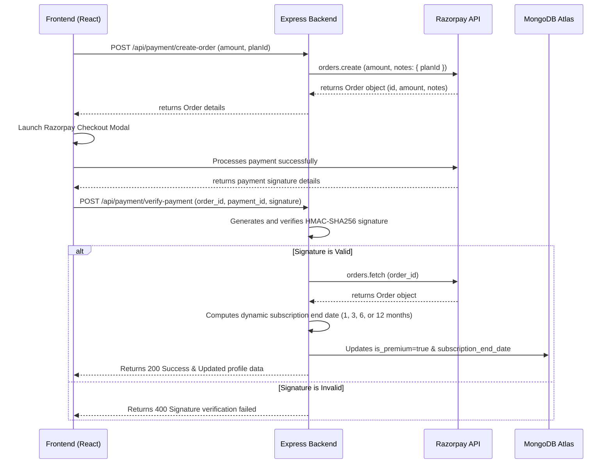

# 🏆 UPTET/CTET Prep App - Professional Documentation

A state-of-the-art, mobile-first full-stack application designed to empower candidates preparing for **UPTET** and **CTET** exams. Built with a premium glassmorphic UI, robust MERN stack architecture, real-time live contests, smart score prediction analytics, and integrated Razorpay subscription systems.

---

### 📂 Module-Specific Documentation
For deeper documentation on implementation and source structures:
- 📱 **Frontend React App**: Detailed configuration, modules, and dependencies in the [client/README.md](file:///c:/Users/91897/Desktop/TET_PREP/client/README.md) guide.
- ⚙️ **Backend Express Server**: Detailed schemas, endpoints listing, and Razorpay validation steps in the [server/README.md](file:///c:/Users/91897/Desktop/TET_PREP/server/README.md) guide.

---

## 📖 Table of Contents
1. [✨ Key Features & Functionalities](#-key-features--functionalities)
2. [📁 Project Architecture & File Structure](#-project-architecture--file-structure)
3. [⚙️ System Workflows & Payment Security](#-system-workflows--payment-security)
4. [🛢️ Database Schema & Models](#%EF%B8%8F-database-schema--models)
5. [🛠️ Installation & Setup](#%EF%B8%8F-installation--setup)
6. [📡 Deployment](#-deployment)
7. [🛡️ Security & Performance](#%EF%B8%8F-security--performance)

---

## ✨ Key Features & Functionalities

### 🎓 Student Prep Portal
*   **Dynamic Dashboard (Practice / Analytics tabs)**:
    *   **Daily Study Goal**: A progress bar showing progress toward a daily target of 25 solved questions.
    *   **Daily Challenge**: A personalized exam containing 30 questions matching the student's exam level and language options.
    *   **Live Contest Room**: Features an automatic registration flow for daily competitive mock exams held at 8:30 PM, complete with waiting rooms, real-time submission limits, and global leaderboards.
    *   **Practice Modes**:
        *   **Full Mock Exams**: Simulated 150-question, 150-minute exam matching real-world conditions.
        *   **Most Repeated Questions**: High-yield PYQs.
        *   **Interactive Flashcards**: Slick front-and-back flip cards for active recall.
    *   **Subject-Wise MCQs**: Specialized practice tests for Child Development & Pedagogy, Hindi, English, Sanskrit, Urdu, Math, EVS, Science, and Social Science.
*   **Bilingual Interface**: Quick one-click toggle to switch the entire application between English and Hindi.
*   **AI-Powered Analytics**:
    *   **Exam Score Predictor**: Estimates actual exam score out of 150 using performance-weighted accuracy history.
    *   **Performance Radar**: Beautiful, responsive SVG Radar Chart mapping strong and weak subjects.
    *   **Topic Insights**: Granular feedback pointing out exactly which chapters need improvement.
    *   **Recent Activity History**: Chronological records of completed tests, scores, and accuracy with redirect links to view detailed step-by-step performance reviews.

### 🛠️ Admin Operations Control
*   **Protected Access**: Dedicated `/admin` route restricted only to authenticated administrator accounts.
*   **User Management**: Live list of registered users with options to grant/revoke roles, reset subscriptions, or edit user profiles.
*   **Question Bank Editor**: Interface to add, search, filter, and delete questions from the database.
*   **Live Contests Controller**: Create future contests, launch them live, or end active ones.
*   **Maintenance Mode switch**: A global emergency switch to put the app in maintenance mode for standard users while keeping admins active.

---

## 📁 Project Architecture & File Structure

```text
TET_PREP/
├── client/                     # Frontend Application (Vite + React)
│   ├── src/
│   │   ├── components/         # Reusable UI elements (Navbar, BottomNav, Radar, etc.)
│   │   ├── context/            # Auth & Theme React contexts
│   │   ├── pages/              # Primary route screens (Dashboard, Exam, Admin, etc.)
│   │   ├── services/           # Axios HTTP request services (api, paymentService)
│   │   ├── translations.js     # English/Hindi translations mapping dictionary
│   │   ├── App.jsx             # Main router configuration & global state checks
│   │   └── index.css           # Global Tailwind CSS style system & custom variables
│   └── vite.config.js          # Vite build config
├── server/                     # Express Node.js Backend Server
│   ├── middleware/             # JWT auth validation & role check filters
│   ├── models/                 # Mongoose Database schemas (User, Exam, Question, etc.)
│   ├── routes/                 # Express API endpoint routes
│   │   ├── admin.js            # Admin-only operations route
│   │   ├── auth.js             # User register/login/verification route
│   │   ├── cheatsheets.js      # Revision notes library route
│   │   ├── contests.js         # Live contest scheduling and results route
│   │   ├── exams.js            # Exam setup, submission, and history route
│   │   ├── payment.js          # Razorpay orders and verification route
│   │   └── profile.js          # User stats, leaderboard, and user profiles route
│   ├── seeds/                  # Initial database seeds for questions & admin
│   └── index.js                # App entry point and MongoDB initialization
```

---

## ⚙️ System Workflows & Payment Security

### 💳 Premium Plan & Razorpay Flow
The application features a secure full-loop payment flow to prevent client-side price tampering or subscription hijacking.

#### Available Plans
*   **Monthly**: ₹29 (1 Month Premium)
*   **Quarterly**: ₹59 (3 Months Premium)
*   **Half-Yearly**: ₹99 (6 Months Premium)
*   **Yearly**: ₹149 (12 Months Premium)



---

## 🛢️ Database Schema & Models

### 👤 User Model (`users`)
Keeps track of authentication, current profile configurations, progress stats, and subscription status.
*   `user_id` (String, Unique): Custom unique key.
*   `name` (String) / `email` (String, Unique) / `password_hash` (String).
*   `level` (String): Target exam level (`primary` or `junior`).
*   `language1` / `language2` (String): Language preferences.
*   `subject_preference` (String): Target stream (`science`, `arts`, `none`).
*   `role` (String): System level (`user` or `admin`).
*   `questions_solved` / `rank_points` (Number): Global stats.
*   `is_premium` (Boolean): Subscription validity flag.
*   `trial_end_date` (Date): Automatically defaults to 3 days from registration.
*   `subscription_end_date` (Date): Set dynamically upon a successful subscription purchase.

### ❓ Question Model (`questions`)
Stores individual MCQs grouped by exam topics and subjects.
*   `question_id` (String, Unique).
*   `subject` (String): E.g., `pedagogy`, `evs`, `math`, `sanskrit`, etc.
*   `level` (String): Level targeting (`primary`, `junior`, or `both`).
*   `text` (String): Question body.
*   `options` (Array of Strings): Exactly 4 choices.
*   `correct_answer` (Number): 0-indexed index of options array.
*   `explanation` (String): Explains why the selected answer is correct.

### 📝 Exam Record Model (`exams`)
Tracks completed mocks, challenges, and subject tests taken by users.
*   `exam_id` (String, Unique).
*   `user_id` (String): References user taking the test.
*   `exam_type` (String): `daily`, `subject`, `full-mock`, `important`, `year`, or `contest`.
*   `score` (Number): Count of correct answers.
*   `answers` (Array of objects): Stores user answers and correctness flags.
*   `date` (Date): Timestamp of completion.

---

## 🛠️ Installation & Setup

### 1. Environment Configurations
Create `.env` file inside the `server/` directory:
```env
PORT=5005
MONGODB_URI=your_mongodb_atlas_connection_string
JWT_SECRET=your_jwt_signature_secret_key
RAZORPAY_KEY_ID=your_razorpay_api_key_id
RAZORPAY_KEY_SECRET=your_razorpay_api_key_secret
```

Create `.env` file inside the `client/` directory:
```env
VITE_API_URL=http://localhost:5005
VITE_RAZORPAY_KEY_ID=your_razorpay_api_key_id
```

### 2. Local Launch
To quickly start the backend server and frontend client concurrently, run the helper script in the root directory:
```bash
# Run from Windows command line or git bash
start_project.bat
```

Alternatively, launch them individually:
```bash
# Terminal 1: Start Server
cd server
npm install
npm run dev

# Terminal 2: Start Client
cd client
npm install
npm run dev
```

### 3. Database Seeding
To populate the database with initial admin and questions, run:
```bash
cd server
node seed_admin.js
node seeds/questions_pedagogy.js
# Repeat for other subjects inside the seeds directory
```

---

## 📡 Deployment

### Server & Client on Vercel
The MERN application is ready for Vercel out of the box using serverless functions:
1.  Verify `vercel.json` routing configuration in the root directory.
2.  Deploy the root directory to Vercel.
3.  Add all environment variables to Vercel's Project Settings.

---

## 🛡️ Security & Performance
*   **Verifiable HMAC Signatures**: Validates payments via server-side SHA256 hashes before updating subscription flags.
*   **Automatic Cache-Busting**: Cleans up stale Vite service worker registration upon reload to ensure clients receive fresh CSS/JS bundles.
*   **Defensive fallbacks**: Implements clean error boundaries and loading placeholders to guarantee graceful app state recovery if the database or Razorpay API becomes temporarily unresponsive.

---
*Created with ❤️ for future teachers.*
